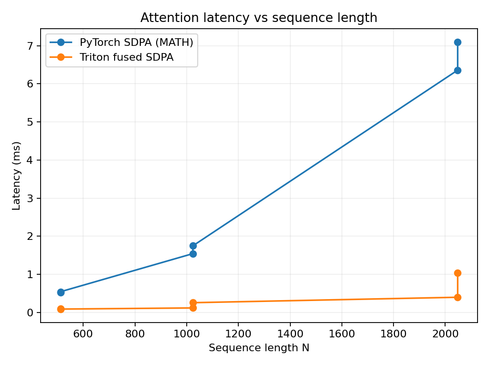
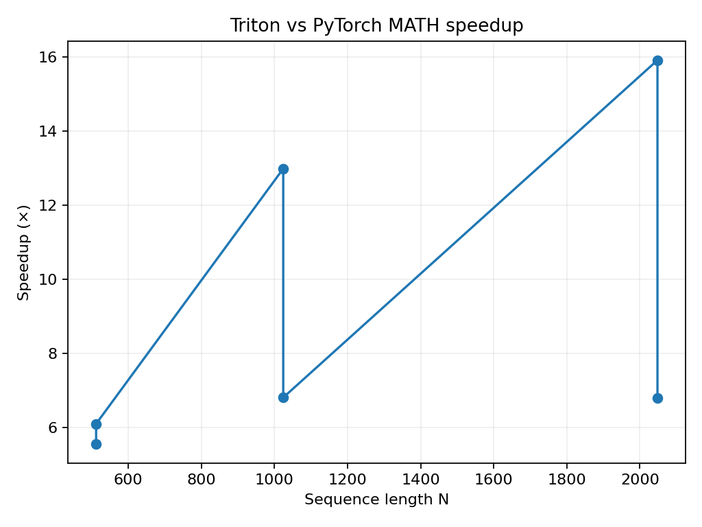

# Triton Fused Attention (FlashAttention-style) on RTX 3060

> **TL;DR:** A compact Triton kernel that fuses QKᵀ → softmax → PV in one pass.  
> On an RTX 3060 (6 GB), it runs **~8–9× faster** than PyTorch’s **MATH** SDPA backend for common decoder shapes.

- **Example (B=1, H=8, N=1024, D=64, fp16):**  
  - PyTorch SDPA (MATH): ~**1.9 ms**  
  - Triton fused SDPA: ~**0.22 ms**  
  - **Speedup:** ~**8.7×**  
  - Max abs error vs reference: ~**1.95e-03**

---

## Table of contents
- [What this repo shows](#what-this-repo-shows)
- [Repo layout](#repo-layout)
- [Requirements](#requirements)
- [Install](#install)
- [Quick start](#quick-start)
- [Benchmark](#benchmark)
- [Profile with Nsight Compute](#profile-with-nsight-compute)
- [Generate charts](#generate-charts)
- [Results snapshot](#results-snapshot)
- [Kernel design in short](#kernel-design-in-short)
- [Troubleshooting](#troubleshooting)
- [Roadmap](#roadmap)
- [License](#license)
- [Acknowledgements](#acknowledgements)

---

## What this repo shows

- A **forward-only, fused scaled dot-product attention** kernel in **Triton** with:
  - Tiled QKᵀ
  - Streaming softmax (numerically stable, no huge intermediate `P`)
  - Fused `P @ V` accumulation
  - Optional causal masking
- A clean **PyTorch wrapper** and micro-benchmark
- A reproducible **Nsight Compute** profiling path
- Scripts to **sweep sequence lengths** and **plot** latency/speedup

---

## Repo layout
├─ fa_triton/
│ ├─ kernels/
│ │ └─ mha_fwd.py # Triton kernel (fused attention)
│ ├─ fa_triton.py # PyTorch wrapper + launch logic
│ └─ bench.py # Micro-benchmark + correctness check
├─ bench_sweep.py # Batch multiple N and save CSV
├─ plot_results.py # Plot latency & speedup from CSV
├─ assets/
│ ├─ latency_vs_seq.png # Generated chart
│ └─ speedup_vs_seq.png # Generated chart
├─ profiles/ # (Optional) Nsight Compute reports (.ncu-rep)
├─ .gitignore
└─ README.md


---

## Requirements

- **OS:** Windows 11 (tested)  
- **GPU:** NVIDIA RTX 3060 (sm\_86), 6 GB VRAM  
- **Python:** 3.11  
- **CUDA Toolkit:** 11.8  
- **PyTorch:** 2.5.1+cu118  
- **Triton:** 3.4.0  
- **Nsight Compute:** optional, for profiling

> Note: PyTorch’s Windows wheels are **not** compiled with the FlashAttention backend. That’s fine—we compare against the **MATH** SDPA baseline.

---

## Install

```bash
# Recommended: fresh virtual env (optional)
# python -m venv .venv && source .venv/Scripts/activate

# PyTorch (CUDA 11.8)
pip install torch==2.5.1+cu118 --index-url https://download.pytorch.org/whl/cu118

# Triton + plotting deps
pip install triton==3.4.0 numpy matplotlib

# FA Triton

A Triton-based Flash Attention implementation optimized for consumer GPUs.

## Quick Start

Run the micro-benchmark and correctness check:

```bash
python -m fa_triton.bench
```

Example output:

```
Max abs error (Triton vs PyTorch MATH): 1.953e-03
PyTorch SDPA (MATH): 1.89 ms
Triton fused SDPA: 0.22 ms
Speedup vs MATH: 8.70x
```

Use the kernel in your own code:

```python
import torch
from fa_triton.fa_triton import triton_mha

B, H, N, D = 1, 8, 1024, 64
q = torch.randn(B, H, N, D, device='cuda', dtype=torch.float16)
k = torch.randn_like(q)
v = torch.randn_like(q)

out = triton_mha(q, k, v, causal=True)  # shape [B, H, N, D]
```

## Benchmark

Compare **PyTorch SDPA (MATH)** vs **Triton fused** for a single shape:

```bash
python -m fa_triton.bench
```

Change shape/dtype by editing the constants at the bottom of `fa_triton/bench.py` (B, H, N, D, dtype, causal).

## Profile with Nsight Compute

### One-shot profile of the Triton kernel

This exports a `.ncu-rep` file you can open in the Nsight Compute GUI.

```bash
ncu --set full --target-processes all ^
--kernel-name "mha_fwd_kernel" ^
--export "profiles\mha_1024x64.ncu-rep" --force-overwrite ^
python -c "import torch; from fa_triton.fa_triton import triton_mha; \
B,H,N,D=1,8,1024,64; \
q=torch.randn(B,H,N,D,device='cuda',dtype=torch.float16); \
k=torch.randn_like(q); v=torch.randn_like(q); \
torch.cuda.synchronize(); triton_mha(q,k,v,causal=True); torch.cuda.synchronize()"
```

Open the report in **Nsight Compute** and check:
* **Duration / Launch Stats** – kernel time
* **Occupancy** – are SMs idle?
* **Memory Workload** – DRAM/L2 bytes, cache behavior
* **Speed Of Light** – tensor/ALU utilization vs peak

If Nsight says "No kernels were profiled," you likely missed the hot launch. Add a small warmup loop or adjust `--launch-skip/--launch-count`.

## Generate Charts

### Sweep sequence lengths and write CSV

```bash
python bench_sweep.py --dtype fp16 \
--min_len 128 --max_len 2048 --step 128 \
--csv assets/results.csv
```

### Plot latency and speedup

```bash
python plot_results.py --csv assets/results.csv --out assets
```

The README expects these images:
* `assets/latency_vs_seq.png`
* `assets/speedup_vs_seq.png`

```markdown


```

## Results Snapshot

| Shape (B,H,N,D) | Dtype | PyTorch MATH | Triton fused | Speedup | Max abs err |
|-----------------|-------|--------------|--------------|---------|-------------|
| (1,8,1024,64)   | fp16  | ~1.6–1.9 ms  | ~0.20–0.25 ms| **~7–9×** | ~1e-3–2e-3 |

Numbers will vary by driver/toolkit and autotune picks, but the pattern holds: big win vs MATH at common decoder sizes.

## Kernel Design in Short

* **Tiling:** process queries in `BLOCK_M` rows and keys/values in `BLOCK_N` columns.
* **Streaming softmax:** keep per-row `(m_i, l_i)` across K/V tiles (numerically stable).
* **Fusion:** compute `QKᵀ` → causal mask → exponentiate → update `acc += P @ V` without materializing `P`.
* **Autotune:** sweep `BLOCK_{M,N,D}` and `num_warps`, respecting RTX 3060 shared memory (~100 KB/block). Cache best configs per `(N, D, dtype)`.

## Troubleshooting

* **"No kernels were profiled"** in Nsight: Warm up a few runs before profiling, or bump `--launch-skip` / `--launch-count`.
* **PTXAS errors / illegal memory access**: Use the provided kernel (it avoids unsupported PTX cache flags on sm_86). If you experiment, keep loads/stores simple (`tl.load/tl.store` defaults) and re-autotune.
* **Windows SDPA warnings**: PyTorch on Windows often disables memory-efficient/Flash SDPA. That's fine—we compare against **MATH**.
* **Repo too big**: Don't commit `.ncu-rep` or `.triton_cache`. They're ignored in `.gitignore`. If you must keep profiler reports, use **Git LFS**.

## Roadmap

* Backward kernel
* Bias / general masks
* Larger head dims & mixed-precision variants
* Persist autotune winners per GPU architecture

## License

MIT

## Acknowledgements

Inspired by FlashAttention and Triton community examples. This repo shows how to apply those ideas end-to-end on a consumer GPU with clear benchmarks and profiles.